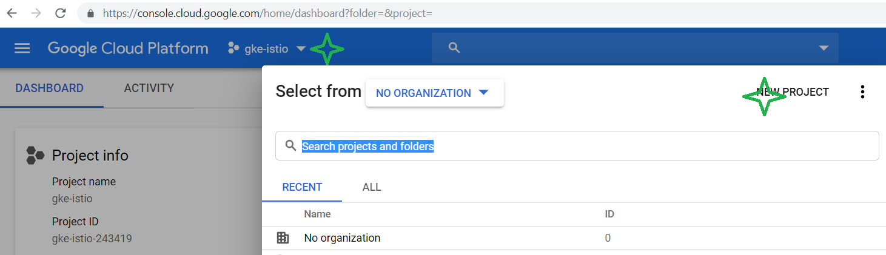
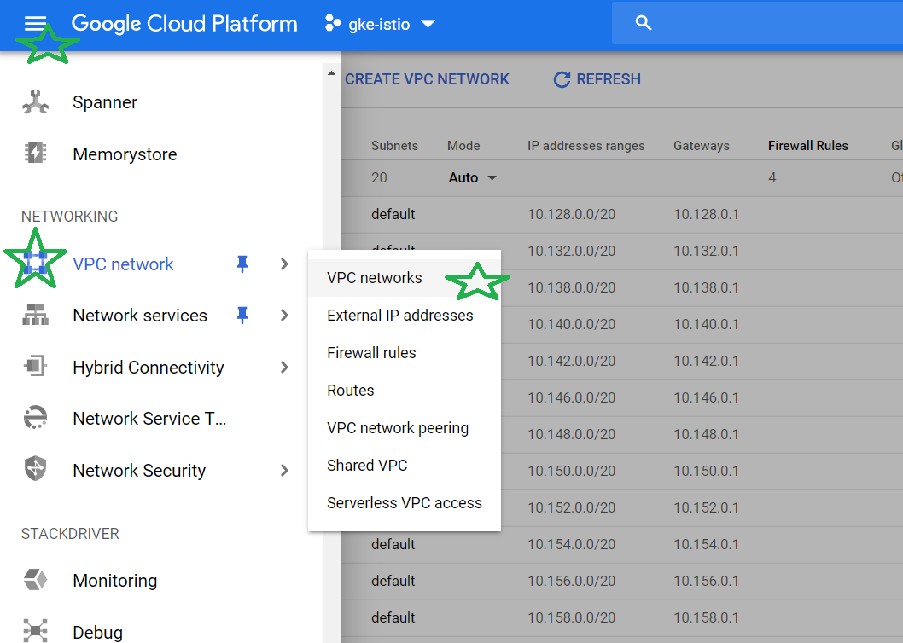
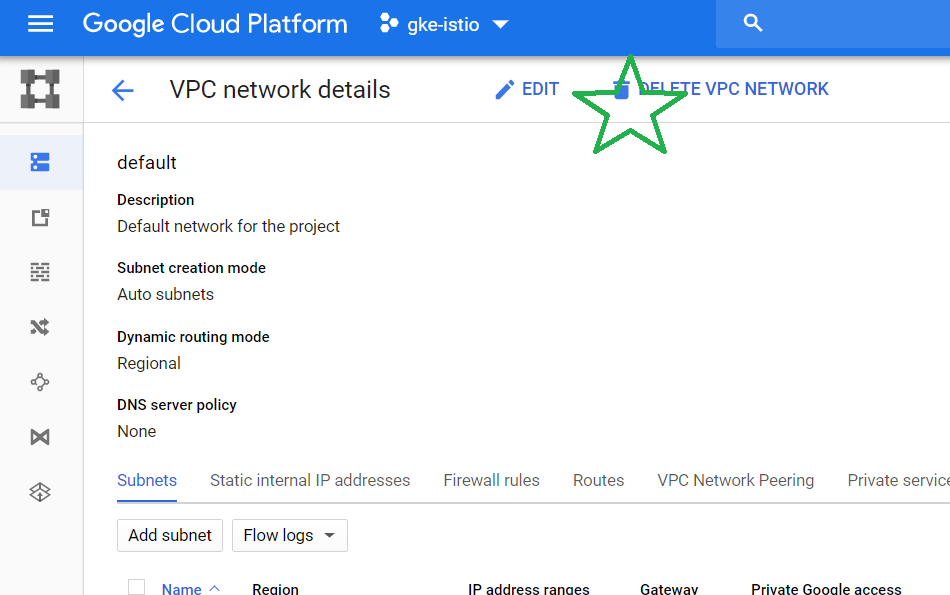
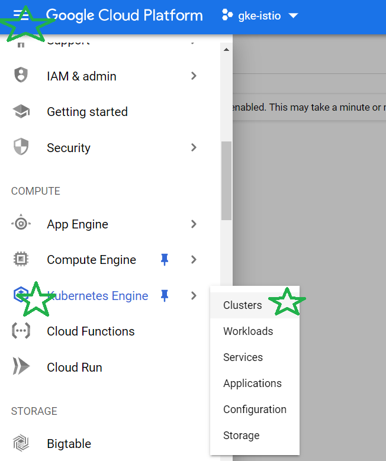
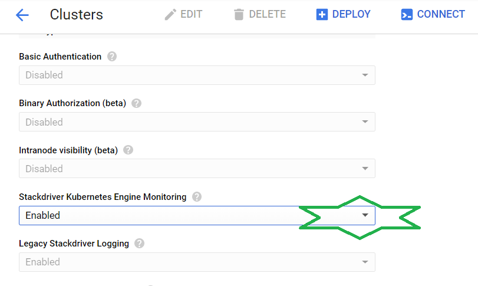
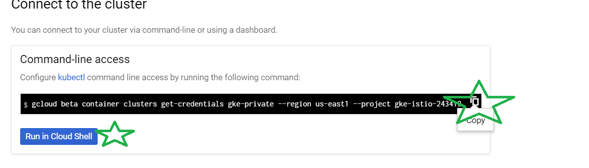

# Introduction
This tutorial aims to showcase the work of microservices demo
application in private GKE cluster.
This tutotial assumes base knowlegde of GCP and Kubernetes concepts.

# Infrastructure setup

## Project creation
#### Steps
- Login to Google Cloud console visiting https://console.cloud.google.com/home
- Open project selection drop-down menu and create a new project

- Create gke-istio project, note the dynamic project generated name
- In project selection menu, choose the newly created project
#### Expected result: 
- Project home dashboard should be opened


## Delete the project default network
#### Steps
- Ensure that gke-istio project is selected in Google Cloud Console
- Open the VPC networks console

- Click on "default" network link in name column

#### Expected result: 
- Project should have no networks listed


## Enabling the Kubernetes API
#### Steps
- Ensure that gke-istio project is selected in Google Cloud Console

- Open the Kubernetes Engine Clusters view
- Approve Kubernetes Cluster API enabling

#### Expected result: 
- Kubernetes API is enabled, and console offers cluster creation


## Accessing the Cloud Shell
#### Steps
- In GCP console, on the top right toolbar, click the Open Cloud Shell button.
- In the dialog box that opens, click START CLOUD SHELL
- List the active account name with this command:
```
gcloud auth list
```
expected output:
```
user@cloudshell:~ (gke-istio-XXXXX)$ gcloud auth list
    Credentialed Accounts
ACTIVE  ACCOUNT
*       user@email
```
#### Expected result: 
- Cloud shell commands can be executed


## Installing terraform
#### Steps
- In Cloud Shell, download and install terraform
- Use the below BASH script, copy entire block and paste in Cloud Shell
```
mkdir -p ~/.tools/terraform
pushd ~/.tools/terraform
export TFVERSION=https://releases.hashicorp.com/terraform/0.12.1/terraform_0.12.1_linux_amd64.zip
wget $TFVERSION
unzip ${TFVERSION##*/}
export PATH="$PATH:$HOME/.tools/terraform"
echo 'export PATH="$PATH:$HOME/.tools/terraform"' >> ~/.bashrc
popd
echo Terraform Installation DONE
```
- Close and re-open Cloud Shell
- Run terraform binary
```
terraform version
```
#### Expected result: 
- Terraform command can be executed reactivating cloud shell


## Clone infrastructure repository
#### Steps
- In cloud shell, execute
```
git clone https://github.com/runonautomation/terraform-google-gke-private.git
```
- Open GKE deployment exampl
```
cd terraform-google-gke-private/example/single_project
```
- List files in directory
```
ls -lahr
```
#### Expected result: 
- main.tf file should be present


## Initialize terraform
#### Steps
- Ensure current working directory is terraform-google-gke-private/example/single_project
- run Terraform initialization, this will prepare the terraform component by initializing a 
local storage backend and creating a module cache, download needed provider binaries
```
terraform init
```
#### Expected result: 
```
...
* provider.google: version = "~> 2.8"
* provider.google-beta: version = "~> 2.8"

Terraform has been successfully initialized!

You may now begin working with Terraform.
...
```

## Enable Istio in terraform
#### Steps
- Ensure current working directory is terraform-google-gke-private/example/single_project
- edit main.tf file using "vi main.tf" and set
```
  disable_istio  = "false"
```
#### Expected result: 
- disable_istio  = "false" is set in terraform

## Deploy Infrastructure with Terraform
#### Steps
- Ensure current working directory is terraform-google-gke-private/example/single_project, terraform initialized
- Ensure Cloud Shell is pointed to expected lab project
```
echo $DEVSHELL_PROJECT_ID
```
- Set terraform project variable TF_VAR_networking_project=##LAB_PROJECT_ID##
```
export TF_VAR_networking_project=$DEVSHELL_PROJECT_ID
```
- Run "terraform plan" and check that plan completes
- Run "terraform apply" and confirm when requested to continue

#### Expected result: 
- Long running apply operation is in progress and completes successfully

## Verify networking setup
#### Steps
- While terraform is running in cloud shell, open another tab in browser and visit 
https://console.cloud.google.com
- Go to VPC networks
- Check that network and subnet is created
- Check network details
- Switch between tabs in network details to check Firewall Rules and routing
- Switch to subnet tab, open subnet details
- Check secondary IP ranges

#### Expected result: 
- Network and subnet are created, subnet has secondary ranges for pods and services

## Enable Beta Stackdriver monitoring
#### Steps
- When terraform is applied, open Kubernetes Engine Clusters view
(Navigation -> Compute -> Kubernetes Engine -> Clusters)
- Open cluster details clicking on cluster name link
- Click Edit
- Enable Stackdriver Kubernetes Engine Monitoring

- Save
- Open Stackdriver Monitoring
- Create workspace
- Go to Resources/Kubernetes Engine

#### Expected result: 
- Stackdriver Kubernetes monitoring gets enabled

## Get cluster credentials
#### Steps
- When terraform is applied, open Kubernetes Engine Clusters view
(Navigation -> Compute -> Kubernetes Engine -> Clusters)
- Click Connect button
- In a window that is opened, click Run in Cloud Shell
- Execute in shell the offered command

```
gcloud beta container clusters get-credentials gke-private --region us-east1 --project XXXXX
```
#### Expected result: 
- Kubectl credentials should be created
```
Fetching cluster endpoint and auth data.
kubeconfig entry generated for gke-private.
```
- command "kubectl get services" returns results